  

  <b>Full-Stack Developer | Backend APIs | Cloud-Ready Apps | Practical Problem Solving</b>

  I build practical software with clean user workflows, REST APIs, authentication, databases, testing, and deployment.

  <a href="https://github.com/John-Paul-Alvarez">GitHub</a>
  ·
  <a href="https://cafe-time-front-end.vercel.app">CafeTime Live Demo</a>

---

## Featured Projects

| Project | What it shows | Stack |
| --- | --- | --- |
| [CafeTime Frontend](https://github.com/John-Paul-Alvarez/cafeTimeFrontEnd) | Cafe ordering UI with menu browsing, cart, checkout, account screens, recommendations, reviews, and delivery tracking | HTML, CSS, JavaScript, Stripe.js, Leaflet, Vercel |
| [CafeTime Backend](https://github.com/John-Paul-Alvarez/cafeTimeBackEnd) | API for auth, carts, Stripe test payments, receipts, orders, recommendations, reviews, and delivery simulation | Node.js, Express, MongoDB, Mongoose, JWT, Jest |
| [Fragments API](https://github.com/John-Paul-Alvarez/fragments) | Authenticated microservice with fragment storage, conversion workflows, Docker, AWS-style persistence, and tests | Node.js, Express, AWS S3/DynamoDB, Docker, Jest |
| [Fragments UI](https://github.com/John-Paul-Alvarez/fragments-ui) | Frontend client for authenticated fragment create, list, update, delete, and conversion workflows | JavaScript, Parcel, Cognito, API integration |
| [Restaurant Reservation](https://github.com/John-Paul-Alvarez/Restaurant-Reservation) | Database-backed reservation workflows for customer and staff use cases | Python, MySQL, Docker, full-stack structure |

---

## Tech Stack

  

**Frontend:** HTML, CSS, JavaScript, React, Next.js, responsive UI, API integration

**Backend:** Node.js, Express, REST APIs, JWT authentication, MongoDB/Mongoose, MySQL

**Cloud and tools:** AWS fundamentals, Docker, Vercel, Render, Git, GitHub Actions

**Testing:** Jest, Supertest, API health checks, integration testing

---

## Current Focus

- Building cleaner full-stack portfolio projects
- Improving backend API design and testing discipline
- Publishing employer-ready repositories with clear documentation
- Practicing data structures, algorithms, and system design

---

  <b>Open to software developer opportunities</b> 
  Full-stack apps | Backend APIs | Databases | Testing | Deployment

  

